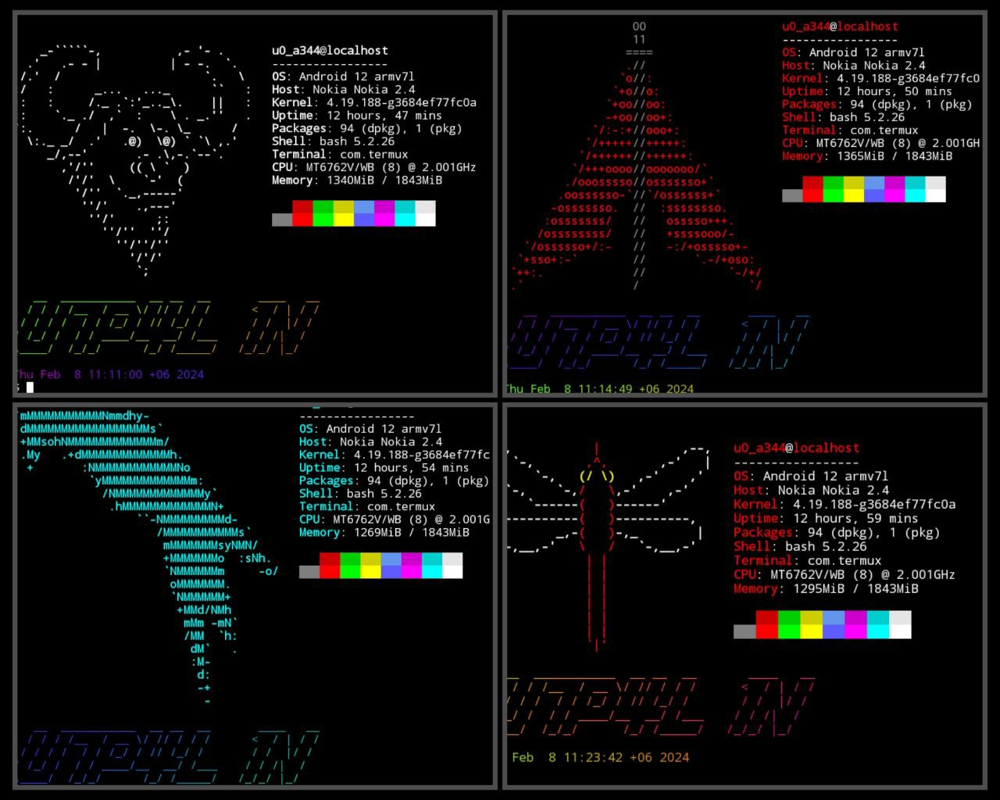

</p>
   <p align="center">
      <a href="https://github.com/U7P4L-IN/T-BANNER/stargazers">
      </a>
      <a href="https://github.com/U7P4L-IN/T-BANNER/releases/latest">
      </a>
      <a href="https://www.conventionalcommits.org/en/v1.0.0/">
      </a>
      <a href="https://github.com/U7P4L-IN/T-BANNER/actions/workflows/github-action.yml">
      </a>
   </p>
   
</br>

> Termux Tbanner is a cool tool to create a custom opening banner in Termux. It makes your Termux Terminal more attractive and personalised because you can create your own banner with your name or any text you want.if you don’t like a banner, you can revert it to Termux’s original mode, including these features tbanner is a perfect tool to create your own custom banner in Termux.
  
<h3 align="center"><b>INSTALLATION > </b></h3>

```bash
apt update && apt -y upgrade
pkg install -y git
termux-setup-storage
rm -rf T-BANNER
git clone --depth=1 https://github.com/U7P4L-IN/T-BANNER.git
cd T-BANNER
chmod +x *
./banner.sh
```
<h3 align="center"><b>COMMAND MENU > </b></h3>

<p align="center">

<h3 align="center"><b>TERMINAL STYLE</b></h3>

<p align="center">
<p align="center">
<p align="center">


<h3 align="center"><b>ANY BANNER REMOVER COMMAND > </b></h3>

```bash
apt update && apt -y upgrade
pkg install -y git
termux-setup-storage
rm -rf BANNER-REMOVER
git clone --depth=1 https://github.com/U7P4L-IN/BANNER-REMOVER.git
cd BANNER-REMOVER
chmod +x *
bash remove.sh
```

<h3 align="center"><b>LANGUAGE</b></h3>

<br>
<a href="https://github.com/U7P4L-IN/FB-BRUTE">
  
</a>

<h3 align="center"><b>DESCRIPTION</b></h3>

> [!NOTE]  
> All the tools are belongs to their copyright owner, and this use is in accordance with the terms and conditions of the copyright holder.

# Give A Star ⭐

> You can also give this repository a star to show more people and they can use this repository